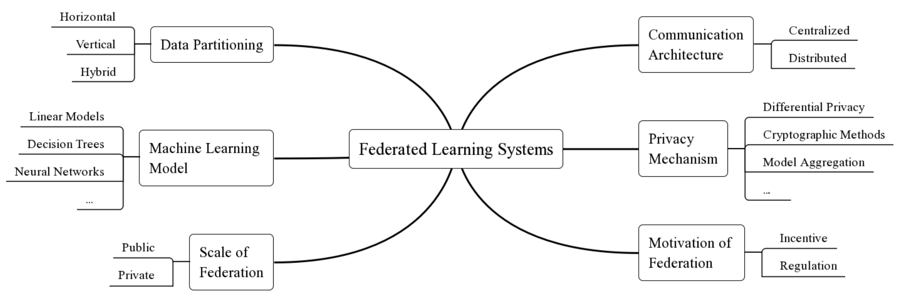

## A Survey on Federated Learning Systems: Vision, Hype and Reality for Data Privacy and Protection

Authors: Qinbin Li, Zeyi Wen, Zhaomin Wu, Sixu Hu, Naibo Wang, Bingsheng He

Abstract: Federated learning has been a hot research area in enabling the collaborative training of machine learning models among different organizations under the privacy restrictions. As researchers try to support more machine learning models with different privacy-preserving approaches, there is a requirement in developing systems and infrastructures to ease the development of various federated learning algorithms. Just like deep learning systems such as Caffe, PyTorch, and Tensorflow that boost the development of deep learning algorithms, federated learning systems are equivalently important, and face challenges from various aspects such as unpractical system assumptions, scalability and efficiency. Inspired by federated systems in other fields such as databases and cloud computing, we investigate the existing characteristics of federated learning systems. We find that two important features for federated systems in other fields, i.e., heterogeneity and autonomy, are also applicable in the existing federated learning systems. Moreover, we provide a thorough categorization for federated learning systems according to six different aspects, including data distribution, machine learning model, privacy mechanism, communication architecture, scale of federation and motivation of federation. The categorization can help the design of federated learning systems as shown in our case studies. Lastly, we take a systematic comparison among the existing federated learning systems and present future research opportunities and directions.

Paper: https://arxiv.org/pdf/1907.09693.pdf

