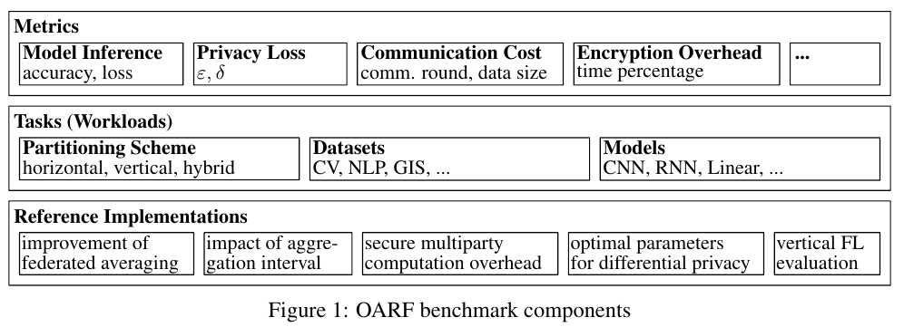

## The OARF Benchmark Suite: Characterization and Implications for Federated Learning Systems

Authors: Sixu Hu, Yuan Li, Xu Liu, Qinbin Li, Zhaomin Wu, Bingsheng He

Abstract: This paper presents and characterizes an Open Application Repository for Federated Learning (OARF), a benchmark suite for federated machine learning systems. Previously available benchmarks for federated learning have focused mainly on synthetic datasets and use a very limited number of applications. OARF includes different data partitioning methods (horizontal, vertical and hybrid) as well as emerging applications in image, text and structured data, which represent different scenarios in federated learning. Our characterization shows that the benchmark suite is diverse in data size, distribution, feature distribution and learning task complexity. We have developed reference implementations, and evaluated the important aspects of federated learning, including model accuracy, communication cost, differential privacy, secure multiparty computation and vertical federated learning.

Paper: https://arxiv.org/pdf/2006.07856

