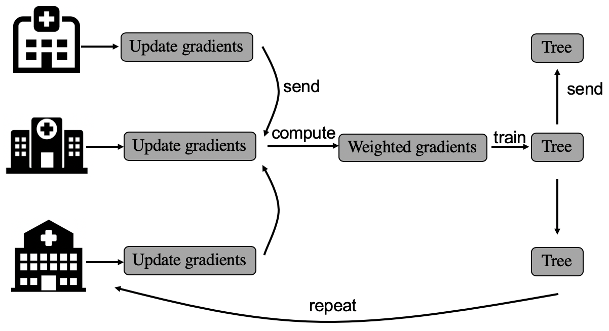
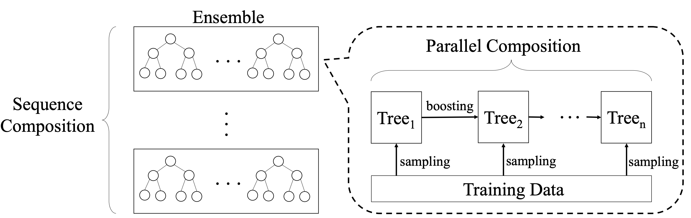

# Private Machine Learning

This repo summarize the private machine learning work of Xtra group. Currently we majorly work on two areas: federated learning and differential privacy.

## Federated Learning
Federated learning enables the collaborative learning of multiple parties without exchanging the local data.

### A Survey on Federated Learning Systems: Vision, Hype and Reality for Data Privacy and Protection

Authors: Qinbin Li, Zeyi Wen, Zhaomin Wu, Sixu Hu, Naibo Wang, Bingsheng He

Abstract: Federated learning has been a hot research area in enabling the collaborative training of machine learning models among different organizations under the privacy restrictions. As researchers try to support more machine learning models with different privacy-preserving approaches, there is a requirement in developing systems and infrastructures to ease the development of various federated learning algorithms. Just like deep learning systems such as Caffe, PyTorch, and Tensorflow that boost the development of deep learning algorithms, federated learning systems are equivalently important, and face challenges from various aspects such as unpractical system assumptions, scalability and efficiency. Inspired by federated systems in other fields such as databases and cloud computing, we investigate the existing characteristics of federated learning systems. We find that two important features for federated systems in other fields, i.e., heterogeneity and autonomy, are also applicable in the existing federated learning systems. Moreover, we provide a thorough categorization for federated learning systems according to six different aspects, including data distribution, machine learning model, privacy mechanism, communication architecture, scale of federation and motivation of federation. The categorization can help the design of federated learning systems as shown in our case studies. Lastly, we take a systematic comparison among the existing federated learning systems and present future research opportunities and directions.

Paper: https://arxiv.org/pdf/1907.09693.pdf

### Practical Federated Gradient Boosting Decision Trees

Authors: Qinbin Li, Zeyi Wen, Bingsheng He

Abstract: Gradient Boosting Decision Trees (GBDTs) have become very successful in recent years, with many awards in machine learning and data mining competitions. There have been several recent studies on how to train GBDTs in the federated learning setting. In this paper, we focus on horizontal federated learning, where data samples with the same features are distributed among multiple parties. However, existing studies are not efficient or effective enough for practical use. They suffer either from the inefficiency due to the usage of costly data transformations such as secret sharing and homomorphic encryption, or from the low model accuracy due to differential privacy designs. In this paper, we study a practical federated environment with relaxed privacy constraints. In this environment, a dishonest party might obtain some information about the other parties' data, but it is still impossible for the dishonest party to derive the actual raw data of other parties. Specifically, each party boosts a number of trees by exploiting similarity information based on locality-sensitive hashing. We prove that our framework is secure without exposing the original record to other parties, while the computation overhead in the training process is kept low. Our experimental studies show that, compared with normal training with the local data of each party, our approach can significantly improve the predictive accuracy, and achieve comparable accuracy to the original GBDT with the data from all parties.

Paper: https://arxiv.org/pdf/1911.04206.pdf

Remark: accepted to AAAI 2020.

### Federated Learning Benchmark

TBD

## Differential Privacy
Differential privacy is a strong privacy guarantee for individual record protection.

### Privacy-Preserving Gradient Boosting Decision Trees

Authors: Qinbin Li, Zhaomin Wu, Zeyi Wen, Bingsheng He

Abstract: The Gradient Boosting Decision Tree (GBDT) is a popular machine learning model for various tasks in recent years. In this paper, we study how to improve model accuracy of GBDT while preserving the strong guarantee of differential privacy. Sensitivity and privacy budget are two key design aspects for the effectiveness of differential private models. Existing solutions for GBDT with differential privacy suffer from the significant accuracy loss due to too loose sensitivity bounds and ineffective privacy budget allocations (especially across different trees in the GBDT model). Loose sensitivity bounds lead to more noise to obtain a fixed privacy level. Ineffective privacy budget allocations worsen the accuracy loss especially when the number of trees is large. Therefore, we propose a new GBDT training algorithm that achieves tighter sensitivity bounds and more effective noise allocations. Specifically, by investigating the property of gradient and the contribution of each tree in GBDTs, we propose to adaptively control the gradients of training data for each iteration and leaf node clipping in order to tighten the sensitivity bounds. Furthermore, we design a novel boosting framework to allocate the privacy budget between trees so that the accuracy loss can be further reduced. Our experiments show that our approach can achieve much better model accuracy than other baselines.

Paper: https://arxiv.org/pdf/1911.04209.pdf

Remark: accepted to AAAI 2020.

